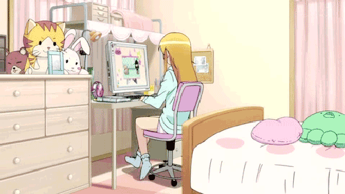

<!-- ✨ Header with Animated Banner ✨ -->

  
  
  <!-- Name with Gradient Text -->
  <h1 align="center" style="background: linear-gradient(45deg, #ff9a9e 0%, #fad0c4 99%, #fad0c4 100%); -webkit-background-clip: text; -webkit-text-fill-color: transparent; margin: 15px 0;">
    🌸 Ekta Rajput 🌸
  </h1>
  
  <!-- Typing Animation -->
  
  
  <!-- Tech Icons Floating -->
  

    
  

  
  <!-- Glowing Badges -->
  

    
    
    
  

 

<!-- 🌸 About Me Section 🌸 -->
##  About Me

  <table>
    <tr>
      <td width="60%" style="padding-right: 30px;">
        
✨ I'm <b>Ekta Rajput</b> — a passionate developer who loves transforming ideas into scalable digital solutions.

        
💻 Full Stack Developer specializing in <b>MERN stack</b> and <b>Python</b> ecosystems.

        
☁️ Cloud enthusiast exploring <b>AWS</b>, <b>Azure</b>, and containerization.

        
🤖 Currently diving deep into <b>AI/ML</b> and <b>generative AI</b> applications.

        
🨠UI/UX design lover who believes in <b>beautiful, functional interfaces</b>.

        
🌱 Always learning: <b>System Design</b>, <b>DevOps</b>, and <b>Cloud Architecture</b>.

      </td>
      <td width="40%">
        
      </td>
    </tr>
  </table>

 

<!-- 🛠️ Tech Stack Section 🛠️ -->
## 🛠️ Tech Stack

  
### 💻 Programming Languages

### 🌐 Web Development

### 🎨 Frontend Design

### ☁️ Cloud & DevOps

 

<!-- 📊 GitHub Stats Section 📊 -->
## 📊 GitHub Stats

  
      
  
    
  
   
  

 

<!-- 🌸 Let's Connect Section 🌸 -->
## 🌸 Let's Connect

  
  
  
  

 

<!-- ✨ Quote Section ✨ -->

  <h3 style="color: white; margin: 0;">✨ Quote I Live By ✨</h3>
  <blockquote style="color: white; font-style: italic; font-size: 18px;">
💡 "Ekta, every great app starts with a single line of code — and you’ve already started!"
🚀 "Ekta, don’t worry about being perfect. Just keep building — progress is the real win!"
🌱 "Code grows with you, Ekta. The more you learn, the more powerful your creations become."
🔥 "Bugs fear you, Ekta. You’re the debugger queen — stay consistent, stay confident!"
  </blockquote>

<!-- 🌸 Footer 🌸 -->

  

